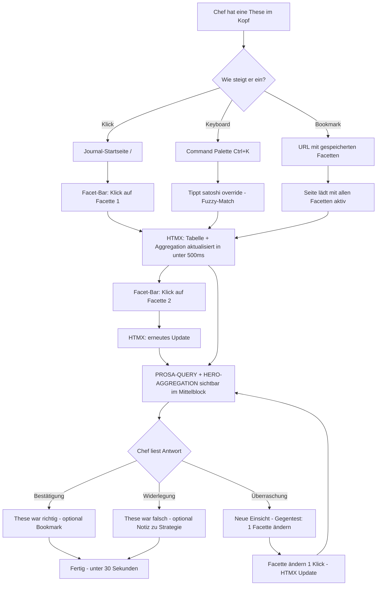
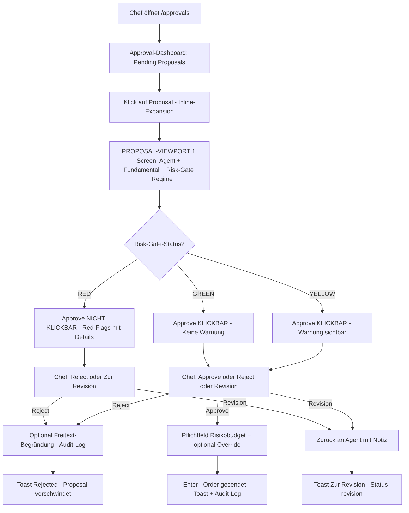
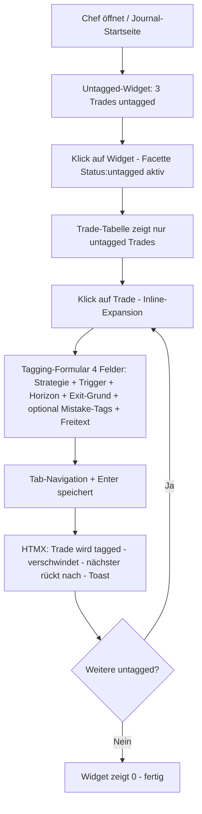
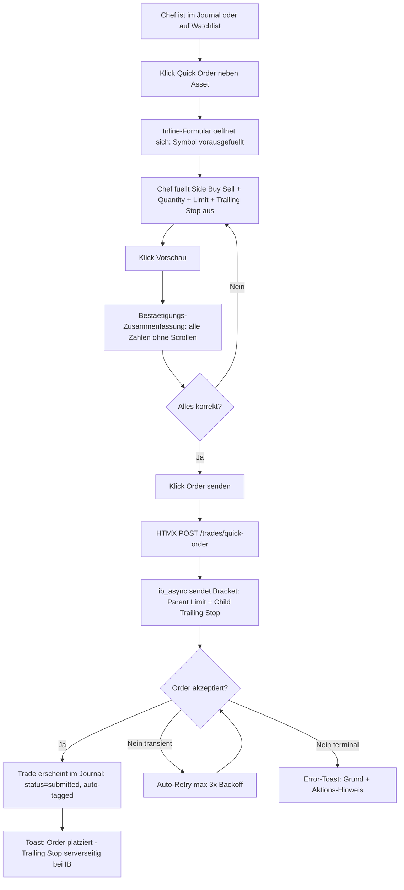

---
stepsCompleted:
  - step-01-init
  - step-02-discovery
  - step-03-core-experience
  - step-04-emotional-response
  - step-05-inspiration
  - step-06-design-system
  - step-07-defining-experience
  - step-08-visual-foundation
  - step-09-design-directions
  - step-10-user-journeys
  - step-11-component-strategy
  - step-12-ux-patterns
  - step-13-responsive-accessibility
  - step-14-complete
workflowCompletedAt: '2026-04-12'
lastUpdated: '2026-04-13'
lastUpdateReason: 'Post-IR-Cleanup — Journey 6 (IB Quick-Order) ergänzt; 3 neue Components (trade_chart, quick_order_form, quick_order_preview) im Tier-2-Inventar; stale DuckDB/Screenshot-Referenzen auf PostgreSQL/lightweight-charts umgestellt'
inputDocuments:
  - _bmad-output/planning-artifacts/product-brief-ctrader.md
  - _bmad-output/planning-artifacts/product-brief-ctrader-distillate.md
  - _bmad-output/planning-artifacts/prd.md
workflowType: 'ux-design'
projectType: 'web-application-htmx-server-rendered'
---

# UX Design Specification ctrader

**Author:** Chef
**Date:** 2026-04-11

---

<!-- UX design content will be appended sequentially through collaborative workflow steps -->

## Executive Summary

### Project Vision

ctrader ist eine persönliche Trading-Werkstatt für einen einzelnen Nutzer (Chef), die ein vereinigtes Trade-Journal für manuelle IB-Trades mit einer human-gated AI-Agent-Farm für cTrader-Bot-Trades verbindet. Der zentrale UX-Anspruch ist **Review-Geschwindigkeit** — jede Design-Entscheidung wird daran gemessen, ob sie den kognitiven Aufwand eines Trade- oder Strategie-Reviews **unter den Aufwand der ursprünglichen Trade-Analyse drückt**. Die UI ist kein Consumer-Journal, sondern eine **Informations-Dichte-Oberfläche** im Stil eines Cockpits — dicht, präzise, mit harten Navigations-Garantien.

### Target Users

**Eine einzige Persona: Chef.** Keine Sekundär-Nutzer, keine Multi-Tenant-Logik, keine Onboarding-Flows.

- **Technische Reife:** Python-Entwickler, liest Code und SQL, versteht JSONB
- **Umgebung:** Desktop-Browser auf Linux-Localhost (`127.0.0.1`), mittelgroßer bis großer Monitor. Kein Mobile, kein Tablet, keine Touch-Optimierung
- **Arbeitskontext:** Nebenberufliches Trading neben Tagesjob — kurze, intensive Zeitfenster morgens, abends und am Wochenende
- **Emotionale Grundierung:** Post-Scope-Explosion-Trauma aus zwei abgebrochenen Vorprojekten; möchte ein Tool, das nicht enttäuscht — keine halb-fertigen Features, keine leeren Zustände, keine Fake-Progress-Indicators
- **Erwartungshaltung:** Arbeitet mit dem Tool täglich, akzeptiert hohe Informations-Dichte gegen den Preis schnellerer Entscheidungen

**Fünf Nutzungs-Modi**, in denen Chef die UI bedient (direkt aus den PRD-Journeys):

1. **Manueller Trader-Modus** — Post-hoc-Tagging von IB-Trades. Kurz, präzise, Dropdown-lastig, Muscle-Memory-fähig.
2. **Bot-Operator-Modus** — Approval-Entscheidungen treffen. Maximale Konzentration, alle entscheidungsrelevanten Informationen in einem Viewport.
3. **Strategy-Reviewer-Modus** — Wöchentlicher Lern-Loop. Explorativer, datenreicher, weniger Zeitdruck.
4. **Analyst-Modus** — Thesen-Validierung via Facettenfilter und Aggregations-Anzeige.
5. **System-Operator-Modus** — Montagmorgen-Gordon-Diff + Regime-Snapshot + Health-Check. Schnelle Orientierung, Farb-Codierung, Drilldown nur bei Anomalien.

### Key Design Challenges

**1. Dichte ohne Überwältigung.** Der Approval-Drilldown muss ~15 entscheidungsrelevante Datenpunkte (Agent-Proposal, Fundamental-Side-by-Side, Risk-Gate-Status, Regime-Kontext, Position-Size, Stops, Risikobudget, Override-Flag) in einem **einzigen Viewport ohne Scroll und ohne Tab-Wechsel** zeigen. Das ist eine Informations-Verdichtung im Stil von Flugzeug-Cockpits, nicht Consumer-Apps.

**2. Trigger-Provenance sichtbar machen ohne Raw-JSON.** Die strukturierte `trigger_spec` (JSONB) muss in einer **lesbaren, erzählenden Form** dargestellt werden — als wäre sie ein natürlichsprachlicher Satz, nicht ein `JSON.stringify()`-Output. Das erfordert eine Schablonen-basierte Text-Serialisierung pro Trigger-Typ.

**3. Facettenfilter als zentrales Navigations-Paradigma.** Mindestens 8 Pflicht-Facetten (Asset-Class, Broker, Strategie, Trigger-Quelle, Horizon, Gefolgt-vs-Überstimmt, Confidence-Band, Regime-Tag) müssen ohne Page-Reload kombinierbar sein. Das klassische Sidebar-Filter-Pattern ist zu schwergewichtig — Facetten müssen als **primäre Navigations-Layer**, nicht als Sekundär-Feature designt werden.

**4. Der "Chef-Moment" als Performance-Metrik.** Die Leitfrage *"Zeig mir alle Verlust-Trades, bei denen ich einen Viktor-Red-Flag überstimmt habe"* muss in **unter 30 Sekunden inklusive Aggregations-Anzeige** beantwortbar sein. Jede UX-Entscheidung wird daran gemessen.

**5. Drei Horizonte, eine UI.** Daytrading, Swing und Position sind fundamental unterschiedliche Review-Erlebnisse (Intraday-Charts vs. Tages-Candles vs. Wochen-Zyklen). Alle drei müssen in derselben Strategy-Review-UI darstellbar sein, ohne dass einer der drei stiefmütterlich behandelt wird.

**6. Graceful Degradation bei MCP-Outages.** Wenn Viktor/Satoshi/Gordon nicht erreichbar sind, muss das Journal **funktional sichtbar bleiben** mit einem klaren *"Nicht verfügbar, Stand XX:XX"*-Zustand, der nicht wie ein Fehler wirkt, sondern wie normale Information. Default-UX-Reflex (Abwesenheit verstecken) ist hier falsch.

**7. Multi-Agent-Vorbereitung ohne Multi-Agent-Komplexität.** Der MVP hat einen Bot, aber die `agent_id`-Spalte ist schon im Schema. Die UX muss für einen Agent gebaut werden, ohne dass eine spätere Migration zu 5 oder 10 Agents jedes Layout bricht. Agent-Name muss überall konsistent als Feld sichtbar sein, auch wenn er im MVP konstant bleibt.

### Design Opportunities

**1. Das Journal als Query-Oberfläche etablieren.** Kein existierendes Trade-Journal behandelt sich selbst als Query-Interface über das *Warum*. ctrader kann Facettenfilter zum **zentralen Navigations-Paradigma** machen, nicht zur Sidebar-Funktion — eine echte UX-Innovation.

**2. Der Side-by-Side-Proposal-Viewport.** *"Agent sagt X, Fundamental sagt Y, Risk-Gate sagt Z, Chef entscheidet"* in einem Blick — ein neuer UX-Pattern für human-gated AI-Entscheidungen. Wenn das gelingt, ist es ein Blueprint für andere AI-Operator-UIs.

**3. Der P&L-Kalender als zeitliche Navigations-Kartographie.** Nicht nur Heatmap, sondern Einstiegspunkt für jeden Filter. Klick öffnet Trades des Tages, Hover zeigt Regime-Kontext und Gordon-HOT-Pick-Status. Das ist mehr, als TraderSync mit seinem Signatur-Kalender liefert.

**4. Horizon-Empirie als prominente Dashboard-Surface.** Drei Expectancy-Kurven nebeneinander (Intraday/Swing/Position) auf der Startseite, jederzeit sichtbar, ohne Drilldown. Die Kern-Frage des MVP wird zum zentralen Dashboard-Element.

**5. Review-Speed als messbares Design-Ergebnis.** Explizites Klick-Budget pro Journey, gemessen und im UX-Dokument verankert. Jede spätere Design-Änderung wird daran gemessen, ob sie das Budget einhält.

## Core User Experience

### Defining Experience

ctrader hat **zwei komplementäre Core Actions**, die miteinander verwoben sind und beide effortless sein müssen:

**1. Review (Daily/Weekly).** Der Lern-Loop. *"Was ist passiert, warum, was lerne ich daraus?"* Exploratives Querleisen durch Trades, Strategien und Filter. Wenn Review hakelig ist, wird es nicht gemacht — und der gesamte MVP-Zweck kollabiert.

**2. Approval (ad hoc).** Der Human-in-the-loop-Moment für Bot-Proposals. *"Soll dieser Trade ausgeführt werden?"* Entscheidungs-fokussiert, hohe Konzentration, wenige aber die richtigen Informationen. Wenn Approval hakelig ist, umgeht Chef das Risk-Gate aus Bequemlichkeit — und der Provenance-Anspruch bricht.

Wenn eine der beiden Aktionen hervorgehoben werden müsste, wäre es **Review** — ohne Review ist der Bot-Teil ein leerer Log.

### Platform Strategy

- **Web-Only, Desktop-Browser** auf `127.0.0.1` (Localhost)
- **Server-rendered HTML** via FastAPI + HTMX + Tailwind — keine SPA, kein Client-Side Routing, kein JavaScript-Build-Step
- **Keyboard + Maus** als Input-Paradigma; keine Touch-Optimierung
- **Kein Offline-Modus** — wenn die App nicht läuft, gibt es nichts zu zeigen; Graceful Degradation betrifft nur MCP- und Broker-Ausfälle, nicht die App selbst
- **Zielbildschirm 1440px Breite** als Design-Target; darunter ist Notfall-Modus, darüber ist Bonus
- **Dark Mode Only im MVP** — keine Theme-Umschaltung; eine konsequent durchgezogene Farbphilosophie
- **Alpine.js nur punktuell**, dort wo HTMX-Pattern nicht ausreichen (z.B. Multi-Select-Facettenfilter mit Live-Preview)

### Effortless Interactions

Priorisiert nach **Häufigkeit × kognitiver Kosten**:

**1. Facetten-Filter anwenden und zurücksetzen** — Ein-Klick-Toggle, <500ms Aktualisierung, Aggregations-Anzeige **inline sichtbar**, keine Apply-Klick-Geste, kein Spinner, kein Modal.

**2. Trade-Drilldown öffnen und schließen** — Ein Klick auf die Trade-Zeile öffnet die Detail-Ansicht als Inline-Expansion oder Split-Screen mit Stateful-URL. Escape/Back kehrt zum gefilterten Zustand zurück, nicht zur ungefilterten Startseite.

**3. Approval-Entscheidung treffen** — Approve/Reject mit Keyboard-Shortcut (`A` / `R`). Pflicht-Feld "Risikobudget" hat Default-Wert aus Proposal, Enter submittet. Aufwand: 2 Tastendrücke statt Maus-Reise.

**4. Post-hoc-Tagging** — Dropdown mit Auto-Focus, Tab-Navigation zwischen Feldern, Enter speichert. Maximal 4 Felder pro Tagging-Vorgang.

**5. Gordon-Diff Montagmorgen-Check** — Eine Seite, ein Blick, grün/rot/grau Indikatoren. Drilldown nur bei expliziter Anomalie.

**6. Strategy-Status wechseln** — Ein-Klick-Wechsel in der Strategy-Liste zwischen active/paused/retired. Kein Bestätigungs-Modal, nur ein kurzer Toast am unteren Rand.

### Critical Success Moments

**Moment 1 — Der "Chef-Moment" der Provenance-Suche.** Chef stellt zum ersten Mal die Leitfrage *"Zeig mir alle Verlust-Trades, bei denen ich einen Viktor-Red-Flag überstimmt habe"* und bekommt in unter 30 Sekunden eine konkrete Zahl mit Aggregations-Metriken. **Das ist der Moment, in dem ctrader seinen Daseinsgrund beweist.**

**Moment 2 — Die erste RED-Blockade.** Chef möchte ein Bot-Proposal genehmigen, aber das Risk-Gate zeigt RED und der Approve-Button ist nicht klickbar. Die UX muss klar kommunizieren *warum* (Liste der Red-Flags mit Klick auf Details), damit der Block wie Schutz wirkt, nicht wie Bevormundung.

**Moment 3 — Der Montagmorgen-Kalt-Start.** Nach einem Wochenende öffnet Chef ctrader. In den ersten 2 Sekunden muss er sehen: *"Was lief letzte Woche? Was ist Gordons Trend diese Woche? Gibt es pending Proposals?"* Ohne Klicks.

**Moment 4 — Die erste Horizon-Empirie-Entscheidung.** Nach ~30 Trades pro Horizon sieht Chef zum ersten Mal eine echte Aussage wie *"Intraday: −0.15R, Swing: +0.32R"* und kann inline eine Strategy-Pausierung auslösen. Innovation-Claim 3 wird hier bewiesen oder widerlegt.

**Moment 5 — Der erste Journal-Export.** Wenn Chef zum ersten Mal Daten exportieren will (Steuer, Backup, externe Analyse), muss das trivial sein — ein "Export CSV"-Button pro Ansicht. Data-Lock-in-Feeling muss strukturell vermieden werden.

### Experience Principles

**Prinzip 1 — Dichte vor Weiß.**
Cockpit, nicht Notion. Weiße Flächen sind verschwendete Informations-Kapazität. Jeder Pixel muss tragen. Einzige Ausnahme: der Entscheidungs-Fokus im Approval-Viewport braucht ein klares Hierarchie-Zentrum.

**Prinzip 2 — Inline vor Modal.**
Modals sind Anti-Pattern für diesen User. Inline-Expansion, Split-Screen und Stateful-URLs sind Pflicht. Einziges legitimes Modal: "Risikobudget bestätigen" beim Approve-Submit.

**Prinzip 3 — Keyboard vor Maus (für häufige Aktionen).**
Jede Aktion, die Chef mehr als fünf Mal pro Woche ausführt, hat einen Keyboard-Shortcut. Die UI zeigt Tastenkürzel als dezente, aber auffindbare Hinweise.

**Prinzip 4 — Zustand ist URL.**
Jede Ansicht mit aktiven Filtern, Drilldowns und Zeiträumen ist über eine URL reproduzierbar. Chef kann Tabs öffnen, Bookmarks setzen, Browser-Back nutzen, ohne Zustand zu verlieren.

**Prinzip 5 — Graceful Degradation als erste Klasse.**
Fehlende MCP-Daten, Broker-Disconnects, Contract-Drifts sind normale Informationen, keine Fehler. Ein Trade-Drilldown mit *"Viktor-Einschätzung nicht verfügbar, Stand 09:15"* ist so wertvoll wie einer mit voller Einschätzung — nur ehrlicher.

## Desired Emotional Response

### Primary Emotional Goals

ctrader strebt bewusst **andere emotionale Ziele** als typische Consumer-Tools an. Delight, künstliches Excitement und Surprise sind keine legitimen Ziele für ein Trading-Tool — sie sind sogar **kontraproduktiv**, weil sie die emotionale Grundlage für undisziplinierte Entscheidungen schaffen. Stattdessen sollen drei primäre Zustände entstehen:

**1. Nüchterne Zuversicht (Calm Confidence).** Chef soll sich beim Arbeiten mit der Plattform ruhig und beherrscht fühlen — nicht getrieben, nicht aufgeregt. Wenn drei Bot-Proposals warten, ist der erste Gedanke *"OK, ich arbeite die durch"*, nicht *"Scheiße, drei Entscheidungen"*. Das ist eine bewusste Gegenbewegung zur typischen Trader-Adrenalin-Dynamik.

**2. Demut vor Daten (Evidence Humility).** Die UI erinnert Chef daran, dass seine Intuition oft falsch ist und seine Historie oft überraschend. Wenn ein Review zeigt, dass überstimmte Viktor-Red-Flags eine Expectancy von −2.3R haben, soll das **wirken** — nicht als Vorwurf, sondern als Fakt, der zu Verhaltensänderung führt. Das ist der Bildungsauftrag der Plattform.

**3. Handwerkliche Zufriedenheit (Craftsmanship Satisfaction).** Chef soll die Plattform gerne benutzen — nicht weil sie fun ist, sondern weil sie **gut gemacht** ist. Wie ein scharfes Messer oder eine gut organisierte Werkstatt. Das ist der "Werkstatt"-Teil der Trading-Werkstatt-Metapher. Die UI fühlt sich wertvoll an, weil sie präzise funktioniert.

### Emotional Journey Mapping

**Beim ersten Öffnen (Tag 1):** Erleichterung. *"Das Tool funktioniert endlich."* Keine Celebration, keine Onboarding-Tour, keine Konfetti. Die Dinge liegen, wo sie liegen sollen.

**Während des täglichen/wöchentlichen Review:** Konzentriert und ruhig. Die UI steht nicht im Weg. Nach einer Stunde Journal-Arbeit hat Chef das Gefühl, etwas gelernt zu haben — nicht sich durch ein Tool gekämpft zu haben.

**Beim ersten Bot-Approval (Woche 5–6):** Angespannt aber klar. Die Entscheidung ist ein ernster Moment. Die UI versteckt die Anspannung nicht (das wäre falsch), sondern strukturiert sie, damit Chef alle Informationen hat und bewusst entscheidet.

**Beim ersten RED-Block durch das Risk-Gate:** Im Moment der Blockade wahrscheinlich leichte Frustration (normal). **Nach dem Trade** — wenn sich zeigt, dass der geblockte Trade schlecht gewesen wäre — Dankbarkeit. Das System hat vor einem Bequemlichkeits-Fehler geschützt.

**Beim ersten Review nach 4 Wochen:** Verblüffung mit Demut. *"Ich hätte nicht gedacht, dass ich so oft gegen Satoshi stimme und dass es mich so viel kostet."* Das ist der Claim-1-Moment. Die Emotion ist nicht Delight, sondern **erleuchtete Enttäuschung über sich selbst** — und das ist produktiv.

**Beim Erreichen des harten Trading-Meilensteins (Ende Woche 8, optimistisch):** Wenn die 50-Bot-Trade-Schwelle mit Expectancy > 0 erreicht wird, darf die UI klar zeigen: *"Trading-Meilenstein erreicht. Expectancy +0.27R bei 50 Trades, 95%-KI [+0.08, +0.46]."* Das ist ein Moment, in dem **echte, gerechtfertigte Zufriedenheit** angemessen ist — ohne Konfetti, aber mit deutlicher visueller Markierung, dass etwas Wichtiges passiert ist. Die UI darf stolz darauf sein, was Chef erreicht hat — aber **nur dann**, wenn der Meilenstein wirklich überschritten ist. Kein Pseudo-Meilenstein-Theater bei Zwischenschritten.

**Wenn etwas schief geht** (MCP-Ausfall, Broker-Disconnect, Kill-Switch feuert fälschlich): Vertrauen. Das System geht transparent mit dem Problem um — *"Viktor-MCP seit 14:23 nicht erreichbar, letzte Einschätzung von 13:50 wird angezeigt"*. Information statt Alarm. Das baut Vertrauen auf, weil sich die UI wie ein ehrlicher Kollege verhält.

### Micro-Emotions

**Aktiv angestrebt:**
- **Confidence ↔ Confusion** — Chef muss in Sekunden wissen, was er sieht
- **Trust ↔ Skepticism** — ohne Vertrauen in die Daten ist das Journal nutzlos
- **Calm ↔ Anxiety** — Nüchternheit über Adrenalin
- **Satisfaction (handwerklich)** — Freude am gut gemachten Werkzeug
- **Honesty ↔ Illusion** — die UI schmeichelt nicht

**Differenziert behandelt:**
- **Excitement** — künstliches Excitement-Theater ist vermieden (keine Konfetti, keine "Big Win!"-Animationen, keine Streak-Celebrations für Routine-Aktionen). Aber **ehrliches Excitement bei echten Durchbrüchen** ist erlaubt und sogar angestrebt — zum Beispiel beim ersten Erreichen von Expectancy > 0 über 50 Bot-Demo-Trades (dem harten Trading-Meilenstein) oder bei einer verblüffenden Edge-Finder-Erkenntnis. Die UI darf dann klar, aber nicht aufdringlich feiern.

**Bewusst vermieden:**
- **Delight (im Sinne von "überraschende Freude bei Routine-Aktionen")** — überflüssig, weil das Tool nicht überraschen muss, sondern verlässlich sein
- **Belonging** — Single-User, irrelevant

### Design Implications

| Emotionales Ziel | UX-Entscheidung |
|---|---|
| **Calm Confidence** | Dark Mode, gedämpfte Akzentfarben, ruhige Typografie, keine Aufmerksamkeits-kapernden Animationen |
| **Evidence Humility** | Metriken prominent, Interpretation zurückhaltend. Keine "Du machst das großartig!"-Messages. Die Zahl spricht. |
| **Craftsmanship Satisfaction** | Konsistente Abstände, pixel-perfekte Alignments, sauber gerenderte Tabellen, Tastenkürzel, URL-Stateful |
| **Trust in Daten** | Zeitstempel überall sichtbar — *"Stand: 14:23"*. MCP-Outages als explizite UI-States. Audit-Log für Chef sichtbar, nicht versteckt. |
| **Confidence in UI** | Keine versteckten Aktionen. Tastenkürzel sichtbar. Undo für reversible Aktionen, kein Undo für Approvals (müssen bewusst sein). |
| **Ehrlichkeit** | Grün/Rot bei P&L bleibt (konventionell und nützlich für schnelles Lesen), aber **keine Streak-Anzeigen**, keine Celebration-Animationen. Drawdown steht prominent neben Expectancy, damit gute Wochen nicht isoliert glänzen. |

### Emotionen, die aktiv vermieden werden

| Zu vermeidende Emotion | Warum | Anti-Pattern |
|---|---|---|
| **Künstliches Excitement-Theater** | Excitement-Inflation bei Routine-Aktionen stumpft das echte Excitement bei Durchbrüchen ab | Keine Konfetti, keine "Big Win!"-Animationen für einzelne Trades, keine Streak-Celebrations, kein rotes Pulsieren bei Gewinnen |
| **Panik** | Panik führt zu Revenge-Trading | Keine Alarm-Glocken, keine "URGENT"-Badges, keine roten Vollflächen-Backgrounds |
| **Illusion des Erfolgs** | Selbstüberschätzung ist der häufigste Grund für Retail-Trader-Verluste | Keine Streak-Counter, keine "Best week ever!"-Messages, keine Celebration-UI für Zwischenschritte |
| **Schuld / Beschämung** | Wenn Chef einen Mistake-Tag vergibt, soll er nicht bestraft werden | Kein "Again?"-Hinweis, kein Rot-Framing bei Mistake-Tags, sondern neutrale Info-Optik |
| **Überwältigung** | Bei 15 Datenpunkten im Viewport droht Überwältigung, wenn visuelle Hierarchie fehlt | Visueller Rhythmus, konsistente Gruppierung, Fokus-Zentrum |

### Emotional Design Principles

**Prinzip 1 — Die UI schmeichelt nicht.**
Keine Lob-Messages, keine Streak-Badges, keine Animationen bei Gewinnen. Ehrliche Zahlen, ehrliche Labels. Chef ist ein Erwachsener, der Fakten will, keine Schulterklopfer. Ausnahme: beim Erreichen des harten Trading-Meilensteins (Expectancy > 0 über 50 Trades) darf die UI klar markieren, dass etwas Wichtiges passiert ist — einmalig, ohne Theatralik.

**Prinzip 2 — Fehler sind Information, nicht Drama.**
Ein MCP-Ausfall ist ein Kontext-Zustand, kein Notfall. Ein ignorierter Red-Flag ist ein Datenpunkt für den Review, kein Vorwurf. Negative Zustände werden mit derselben Ruhe behandelt wie positive.

**Prinzip 3 — Farbe ist rar, aber P&L bleibt Grün/Rot.**
Grün und Rot werden in ctrader für zwei Zwecke verwendet: **(a) P&L-Zahlen** (konventionell und nützlich für schnelles Lesen — dieser Reflex ist tief eingeübt und ctrader kämpft nicht dagegen) und **(b) diskrete Status-Kategorien** (Risk-Gate GREEN/YELLOW/RED, Verbindungs-Status, Job-Status). Darüber hinaus sind Akzentfarben gedämpft. Farben kapern keine Aufmerksamkeit für Dinge, die nicht entscheidungsrelevant sind.

**Prinzip 4 — Tempo über Präsenz.**
Die UI soll unsichtbar werden, sobald Chef weiß, wie sie funktioniert. Keine Onboarding-Hinweise, keine "Tip of the Day"-Widgets, keine "Have you tried…"-Nudges. Die UI ist ein Werkzeug, keine Konversations-Partnerin.

**Prinzip 5 — Transparenz vor Bequemlichkeit.**
Wenn ein Schritt länger dauert, zeigt die UI den echten Grund, nicht nur einen Spinner. Chef soll wissen, warum etwas dauert — auch wenn die Erklärung nicht schön ist.

## UX Pattern Analysis & Inspiration

### Inspiring Products Analysis

ctrader zieht Inspiration sowohl aus bestehenden Trading-Journal-Tools (deren UX-Entscheidungen die vorangegangene Research-Runde tief analysiert hat) als auch aus gezielten Referenz-Produkten außerhalb des Trading-Raums, deren spezifische UX-Lektionen zum Cockpit-Charakter der Plattform passen.

**Trading-Journal-Inspiration:**

- **Tradervue** — für MFE/MAE-Tiefe (mit Position-vs-Price-Trennung), Exit-Efficiency-Metrik und Tag-Reports als First-Class-View
- **TraderSync** — für P&L-Kalender als zentrale Hero-Navigation und für Playbook-Modul mit Pre-Trade-Checklist
- **Edgewonk** — für analytische Tiefe (Tiltmeter, Edge Finder, Monte-Carlo), auch wenn die konkreten Features Phase 2 sind und nur die Design-Philosophie ("Metriken müssen interpretieren, nicht nur anzeigen") übernommen wird

**Außerhalb des Trading-Raums:**

- **Linear** (Issue-Tracker) — Keyboard-First-Bedienung, Command Palette (`Cmd+K`), optimistic UI, keine Modals
- **Datadog / Grafana** (Observability-Dashboards) — Dichte ohne Überwältigung, Sparkline-Charts als Pflicht-Element, Dead Man's Switch bei stale Daten
- **Bloomberg Terminal** (finanzielles Referenz-Tool) — Tastatur-Muscle-Memory, explizite Farbgrammatik, Command-Line-first, Kein-White-Space-Überschuss
- **Obsidian** (persönliches Knowledge-Management) — lokale Datensouveränität, Markdown als Source of Truth, Plugins als Opt-In

### Transferable UX Patterns

**Pattern 1 — Command Palette (`Ctrl+K`) als universelle Navigation.** Von Linear. Das einzige JavaScript-Feature-Investment, das für den MVP gerechtfertigt ist, weil es die Review-Speed-Metrik direkt adressiert. Fuzzy-Search über alle Routen, Strategien, Facetten-Presets und Trade-IDs. Technisch via Alpine.js realisierbar, keine SPA-Architektur nötig.

**Pattern 2 — Sparklines neben jeder Metrik.** Von Datadog/Grafana. Jede Strategy-Metrik in der Review-Liste bekommt einen Mini-Trend-Chart neben der Zahl. Verwandelt Momentaufnahmen in Zeitreihen. Technisch als Pure-SVG (Sparklines) — nicht zu verwechseln mit dem dedizierten OHLC-Chart für FR13c, der `lightweight-charts` nutzt (siehe Component `trade_chart` in Tier 2).

**Pattern 3 — Dead Man's Switch für MCP-Outages und stale Daten.** Von Datadog/Grafana. Stale-Daten werden **prominent** angezeigt, nicht subtil — als rotbraune Banner oder "Stale"-Badges in der betroffenen View. Nicht als Fehler, sondern als ehrliche Information. Operationalisiert Prinzip 5 aus Step 3 (Graceful Degradation als erste Klasse).

**Pattern 4 — Zeitliche Navigation als Erste Klasse.** Von TraderSync + Grafana. Der P&L-Kalender (FR13b) ist **eine von zwei Einstiegs-Navigations-Säulen neben der Facetten-Suche**. Chef kann wählen zwischen "alle Trades mit Facette X" und "alle Trades vom Tag Y".

**Pattern 5 — Tag-Reports als First-Class-View.** Von Tradervue. Facetten-Navigation führt nicht nur zu einer gefilterten Trade-Liste, sondern zu einer **aggregierten Matrix-Ansicht**, in der jede Tag-Kombination mit ihrer eigenen Expectancy/Winrate/R-Multiple gezeigt wird.

**Pattern 6 — Metriken-Paarung statt Einzel-Werten.** Von Tradervue. Jede Kernmetrik wird neben ihrer Gegenmetrik gezeigt: Expectancy neben Drawdown, Winrate neben Profit-Factor, MFE neben MAE. Die UX erzwingt die Mehrfach-Perspektive.

**Pattern 7 — Lokale Datensouveränität.** Von Obsidian. PostgreSQL läuft auf Chefs eigener Instanz, Datenbank ist direkt per `psql`/`pgAdmin` zugreifbar, `pg_dump`-Backups werden lokal gespeichert, Export-Funktionen (CSV, JSON) sind Pflicht pro View. ctrader ist kein Walled Garden. (Geändert am 2026-04-13: Storage-Umstellung von DuckDB auf PostgreSQL.)

### Anti-Patterns to Avoid

**Anti-Pattern 1 — Onboarding-Tours und Coach Marks.** Widerspricht Prinzip 4 aus Step 4 (Tempo über Präsenz). Keine initiale Tour, keine "Did you know?"-Popups, keine Feature-Discovery-Hints.

**Anti-Pattern 2 — Gamification für Routine-Aktionen.** Streaks, Badges, "You've tagged 30 trades this week!"-Celebrations, Level-Ups. Widerspricht Prinzip 1 aus Step 4 (Die UI schmeichelt nicht).

**Anti-Pattern 3 — Modals für Daten-Drilldowns.** Modals zerstören den Kontext und zwingen zu einer "Ein-Ding-zur-Zeit"-Denkweise. Widerspricht Prinzip 2 aus Step 3 (Inline vor Modal).

**Anti-Pattern 4 — Filter als Sidebar-Sekundär-Feature.** Widerspricht der Design-Opportunity 1 (Journal als Query-Oberfläche). Facetten müssen primäre Navigation sein, nicht eine Nebenfunktion.

**Anti-Pattern 5 — Fake-Responsive-Breakpoints.** ctrader ist Desktop-only — keine Mobile-Breakpoints im MVP. Unter 1024px wird ein Hinweis gezeigt, kein Mobile-Layout.

**Anti-Pattern 6 — Loading Skeletons als Ersatz für echte Daten.** Fühlt sich nach Fortschritt an, aber lenkt ab und versteckt echte Ladezeiten. Stattdessen: ehrliche kleine Spinner mit Kontext (*"Lade MCP-Call an Viktor..."*).

**Anti-Pattern 7 — Standard-Dark-Mode-Theme.** Kein generisches `#1a1a1a`-Hintergrund mit `#cccccc`-Text. ctrader braucht ein eigenständiges Dark-Theme mit klarer Farbgrammatik ("Dark Cockpit", nicht "Dark Notion").

**Anti-Pattern 8 — Infinite Scroll für Trade-Listen.** Verliert den Kontext und codiert Position-State nicht in die URL. Für Trade-Listen mit Queries ist Pagination besser, weil sie stateful URLs erlaubt (Prinzip 4 aus Step 3).

### Design Inspiration Strategy

**Was adoptieren (direkt übernehmen):**

- Command Palette von Linear als einziges JS-Feature-Investment MVP-würdig
- Sparklines neben Metriken von Datadog für die Strategy-Review-Liste
- Farbgrammatik von Bloomberg als explizites Design-System-Prinzip
- Tag-Reports als First-Class-View von Tradervue als Alternative zur Trade-Liste
- Dead Man's Switch von Datadog für MCP-Outages und stale Daten

**Was adaptieren (anpassen für unseren Kontext):**

- P&L-Kalender von TraderSync, aber als doppelte Einstiegs-Navigation neben Facetten-Suche, nicht nur als Hero-View
- MFE/MAE-Darstellung von Tradervue, aber integriert in den Trade-Drilldown, nicht als eigene Reports-Seite
- Monte-Carlo-Philosophie von Edgewonk, aber im MVP reicht die Expectancy-Konfidenzintervall-Anzeige; voller Simulator ist Phase 2
- Lokale Datensouveränität von Obsidian, aber als PostgreSQL auf Chefs eigener Instanz + `pg_dump`-Backups + Export-Buttons, nicht als Plugin-System

**Was explizit nicht tun:**

- Kein Tiltmeter-Äquivalent im MVP — Mistake-Tagging (FR18a) ist die schlankere Variante desselben Konzepts
- Kein Trade-Replay-Widget im MVP — aufgeschoben als Phase-2-Feature
- Keine Mobile-Responsiveness — Desktop-only
- Keine Gamification-Elemente — keine Streaks, keine Badges, keine Celebrations für Routine

## Design System Foundation

### Design System Choice

**Entscheidung: Handroll Design System mit Tailwind CSS + Jinja2-Makros.**

Keine externe Component-Bibliothek (DaisyUI, Flowbite, MUI, etc.). Stattdessen eine eigene, minimale Design-System-Philosophie, die direkt auf den drei Locked Technical Decisions aus dem PRD aufbaut: **FastAPI + Jinja2 + HTMX + Tailwind CSS** ohne JavaScript-Build-Step.

Der Design-System-Kern besteht aus:

1. **Design Tokens** als zentrale CSS-Custom-Properties (`design-tokens.css`)
2. **~12 Jinja2-Makros** als Component-Primitives (`components/*.html`)
3. **Explizite Farbgrammatik** im Bloomberg-Sinne — jede Farbe hat eine feste semantische Rolle, keine dekorative Farbigkeit
4. **Typografie-System** mit zwei Schriftfamilien: Inter (Sans-Serif) für Labels/Prosa, JetBrains Mono (Monospace) für alle Zahlen

### Rationale for Selection

**Warum keine externe Bibliothek:**

- **Stilistische Passung.** DaisyUI, Flowbite und verwandte Libraries sind für allgemeine SaaS-Apps gebaut. Ihre Default-Themes sind "Dark Notion" — rund, freundlich, weich. ctraders UX-Philosophie ist "Dark Cockpit" — hart, präzise, dicht. Jeder Versuch, diese Libraries auf Cockpit umzustellen, würde mehr Override-CSS erzeugen, als wenn Handroll gemacht wird.
- **Component-Spezifität.** Von ~11 benötigten Components sind ~5 so spezifisch (Facetten-Chip, Sparkline, Trigger-Spec-Rendering, Proposal-Viewport, Calendar-Cell), dass keine Bibliothek hilft. Für die restlichen 6 (Button, Card, Dropdown, Toast, Form-Input, Status-Badge) ist der Mehrwert einer Bibliothek marginal — ein Tailwind-Button ist mit 6 Zeilen CSS fertig.
- **Philosophische Passung.** Handroll ist die einzige Option, die zu den Emotional Design Principles aus Step 4 passt: *"Die UI schmeichelt nicht"*, *"Dichte vor Weiß"*, *"Craftsmanship Satisfaction"*. Ein Tool fühlt sich nur dann handwerklich an, wenn es tatsächlich handwerklich gemacht ist.
- **Langzeit-Wartbarkeit.** Bibliotheken sind Abhängigkeiten, die sich ändern (DaisyUI v5 bricht v4, Flowbite ändert Paywall-Grenzen). Handroll ist forever stable — das CSS von heute funktioniert in fünf Jahren genauso. Für ein persönliches Langzeit-Tool ist das ein echter Vorteil.
- **Initial-Aufwand tragbar.** Die ~12 Makros sind pro Stück 10–80 Zeilen Code. Das ist ein ein-Wochen-Projekt in Woche 0/1, kein Infrastruktur-Epos.

### Implementation Approach

**Dateistruktur:**

```
app/
  static/
    css/
      design-tokens.css      # Zentrale CSS-Custom-Properties
      main.css              # Tailwind @layer-Definitionen + Utility-Erweiterungen
  templates/
    components/              # Jinja2-Makros
      stat_card.html
      trade_row.html
      facet_chip.html
      facet_bar.html
      sparkline.html
      status_badge.html
      staleness_banner.html
      trigger_spec_readable.html
      calendar_cell.html
      proposal_viewport.html
      command_palette_item.html
      toast.html
    layouts/
      base.html              # Top-Bar, Navigation, Flash-Messages
      dense.html             # Für Journal-, Strategy-, Approval-Views
    views/                   # Seiten, die Makros komponieren
```

**Tailwind-Compilation:**

- Tailwind CLI (nicht Node/Webpack) via `uv` verwaltete Python-Tool-Abhängigkeit oder direkt `tailwindcss`-Standalone-Binary
- Eine einzige CSS-Output-Datei, die via FastAPI-StaticFiles serviert wird
- `design-tokens.css` wird vor dem Tailwind-Output geladen
- Hot-Reload in Dev-Mode via FastAPI `--reload` + Tailwind `--watch`

**Component Inventar für MVP (12 Makros):**

| Makro | Zweck | Komplexität |
|---|---|---|
| `stat_card(label, value, trend, variant)` | Metriken-Anzeige auf Dashboards | niedrig |
| `trade_row(trade)` | Tabellen-Zeile mit P&L, Strategie, Trigger-Kurzform | mittel |
| `facet_chip(label, active, count)` | Ein Facetten-Filter-Button | niedrig |
| `facet_bar(facets)` | Horizontaler Streifen mit allen Facetten | niedrig |
| `sparkline(data, width, height)` | SVG-Mini-Chart | mittel |
| `status_badge(status, label)` | GREEN/YELLOW/RED-Indicator | niedrig |
| `staleness_banner(last_update, source)` | "Dead Man's Switch"-Anzeige | niedrig |
| `trigger_spec_readable(spec)` | Rendert `trigger_spec` als Natursprache | hoch |
| `calendar_cell(date, pnl, tags)` | Eine Zelle im P&L-Kalender | mittel |
| `proposal_viewport(proposal, fundamental, risk_gate)` | Der gesamte Approval-Viewport | hoch |
| `command_palette_item(label, shortcut, action)` | Ein Eintrag im `Ctrl+K`-Menü | niedrig |
| `toast(message, variant)` | Status-Feedback unten am Bildschirm | niedrig |

### Customization Strategy

**Design Tokens (CSS-Custom-Properties):**

```css
:root {
  /* Background Layers (Dark Cockpit) */
  --bg-void: #0a0e14;           /* schwarzer Hintergrund */
  --bg-chrome: #11161d;          /* Top-Bar, Sidebar */
  --bg-surface: #1a2029;         /* Card, Table */
  --bg-elevated: #232b36;        /* Dropdown, Popover */

  /* Text */
  --text-primary: #e6edf3;
  --text-secondary: #8b949e;
  --text-muted: #6e7681;

  /* P&L (konventionell Grün/Rot) */
  --pnl-gain: #3fb950;
  --pnl-loss: #f85149;

  /* Status (Risk-Gate, Verbindungen, Jobs) */
  --status-green: #238636;
  --status-yellow: #d29922;
  --status-red: #da3633;

  /* Akzent (Navigation, Focus, Links) */
  --accent: #58a6ff;
  --accent-dim: #1f6feb;

  /* Borders */
  --border-subtle: #30363d;
  --border-default: #444c56;

  /* Typografie-Scale */
  --text-xs: 11px;
  --text-sm: 13px;
  --text-base: 14px;
  --text-lg: 16px;
  --text-xl: 20px;
  --text-2xl: 28px;

  /* Font-Families */
  --font-sans: "Inter", system-ui, sans-serif;
  --font-mono: "JetBrains Mono", "Fira Code", monospace;
}
```

**Farbgrammatik explizit:**

| Farbrolle | Verwendung | Nie verwenden für |
|---|---|---|
| **Grün** (`--pnl-gain`, `--status-green`) | P&L im Plus, Risk-Gate GREEN, OK-Status | Deko, generische Success-Messages |
| **Rot** (`--pnl-loss`, `--status-red`) | P&L im Minus, Risk-Gate RED, kritische Fehler | Default-Warnungen, Mistake-Tags |
| **Gelb** (`--status-yellow`) | Risk-Gate YELLOW, Staleness-Warnungen | P&L-Zahlen, Buttons |
| **Akzent-Blau** (`--accent`) | Aktive Navigation, Links, Focus-Rings | P&L-Zahlen, Status |
| **Neutrale Grautöne** | Text, Borders, Hintergründe | Jegliche Signalisierung |

**Typografie-System:**

- **Inter (Sans-Serif)** für Labels, Navigation, Prosa-Text
- **JetBrains Mono (Monospace)** für alle Zahlen (P&L, Strategy-IDs, Preise, Metriken). Monospace ist entscheidend für die Spaltenausrichtung in den dichten Tabellen — proportionale Schriften erzeugen Dichtelücken.

**Philosophie der Erweiterung:**

Wenn ein neuer Component im MVP oder in Phase 2 gebraucht wird, wird er als neues Makro in `components/` hinzugefügt — **nicht** durch Import einer neuen Library. Jede neue Component ist eine **bewusste Entscheidung**, nicht eine Folge einer Library-Update-Routine.

## Defining Core Experience

### The Defining Interaction

Die eine Interaktion, die ctrader definiert, ist nicht eine physische Geste (Swipe, Tap) sondern ein **kognitiver Dialog zwischen Chef und seinen Daten**:

> **"Eine Trading-Frage stellen und in unter 30 Sekunden eine datenbasierte Antwort bekommen."**

Kein bestehendes Trade-Journal behandelt das *Warum* eines Trades als strukturiertes Such-Target. Dadurch kann ctrader Fragen beantworten, die nirgendwo sonst beantwortbar sind — zum Beispiel:

- *"Zeig mir alle Verlust-Trades, bei denen ich einen Viktor-Red-Flag überstimmt habe."*
- *"Wie performen meine News-getriggerten Crypto-Shorts im Vergleich zu Longs?"*
- *"Wie schlägt sich mein Swing-Horizon diese Woche gegen meinen Intraday-Horizon?"*

Diese Interaktion ist nicht Review und nicht Approval — sie ist der **kognitive Kern des Reviews**, der Moment, in dem die Plattform etwas zeigt, was Chef nicht wusste. Wenn Chef einem Freund erzählen würde: *"Ich habe ein Tool, das mein Trading besser macht"*, dann wäre die Konkretisierung: *"Ich kann jede Frage zu meinen Trades stellen und bekomme binnen Sekunden eine Antwort."*

### User Mental Model

Chefs mentales Modell ist **Query statt Browsing**. Der User betrachtet die Plattform als **Orakel**, nicht als Katalog. Der Unterschied ist fundamental:

- **Browsing** (Katalog-Modell) — User weiß nicht, was er sucht, scrollt, entdeckt. Klassisch: Amazon, Netflix, Instagram.
- **Query** (Orakel-Modell) — User hat eine konkrete Frage, die Plattform macht die Umwandlung in Daten trivial. Klassisch: Google, Datadog, SQL.

ctrader ist ein Orakel mit visueller Query-Sprache (Facetten-Klicks statt SQL). Das unterscheidet es von allen existierenden Trade-Journals, die Browsing-Modelle sind.

**Aktuelle Lösungen und ihre Schwächen:**

- **Excel / Pivot-Tabellen** — mächtig, aber 10–20 Minuten pro Frage. Die Frage ist oft vergessen, bevor die Antwort kommt.
- **Bestehende Trade-Journals** (TraderSync, Tradervue, Edgewonk) — bieten Tag-Filter, aber **nicht** strukturierte Trigger-Provenance mit Fundamental-Agent-Overrides. Chef kann "Alle Trades mit Tag X" fragen, aber nicht "Alle Trades, bei denen ich gegen Satoshi entschieden habe".
- **Nachdenken ohne Daten** — die häufigste und gefährlichste Form. Intuition irrt systematisch (Confirmation Bias, Recency Bias, Storytelling-Bias).

ctrader gewinnt durch die Kombination: **Tiefe (wie Excel) + Kontext (Trigger-Provenance + Agent-Overrides) + Geschwindigkeit (<30 Sekunden).**

### Success Criteria

**Messbare Kriterien:**

1. **Time-to-Answer** — Von "Chef denkt an eine Frage" bis "Chef liest die Antwort": **unter 30 Sekunden**. Gemessen als: Facetten-Klicks × Latenz + Lese-Zeit für Aggregation.
2. **Klick-Budget** — Maximal **5 Klicks** von der Startseite bis zur Answer-Aggregation.
3. **Query-Ausdrucksstärke** — Mindestens die **8 Pflicht-Facetten** aus FR10 müssen kombinierbar sein. Alle 8 gleichzeitig aktiv muss eine valide Query ergeben.
4. **Query-Persistenz** — Chef kann seine Query als **URL-Bookmark** speichern und jederzeit wiederholen. Die Query ist in der URL sichtbar, nicht in Server-State versteckt.
5. **Query-Gegentest-Flüssigkeit** — Eine einzelne Facette ändern darf die gesamte Query nicht zurücksetzen; die anderen Facetten bleiben aktiv.

**Emotionales Kriterium:**

Wenn Chef die Aggregation liest, soll er **eines von drei Gefühlen** haben:

- **Bestätigung** (*"Ja, genau wie ich dachte"*) — die These war richtig
- **Widerlegung** (*"Oh, das hätte ich nicht gedacht"*) — die Intuition war falsch
- **Überraschung** (*"Warte, das kannte ich gar nicht"*) — neue Einsicht

Alle drei sind wertvoll. Der vierte mögliche Zustand — **Verwirrung** (*"Ich verstehe die Zahl nicht"*) — ist ein Design-Versagen.

### Novel vs. Established Patterns

**Etablierte Patterns, die wir nutzen (keine Erziehung nötig):**

- **Facettenfilter** (Amazon, eBay, GitHub Issues)
- **Live-Aggregation über Liste** (Google Analytics, Mixpanel, Datadog)
- **Stateful URLs mit Query-Parametern** (Web-Standard seit 1990ern)
- **Badge-Counts an aktiven Facetten**

**Was neu kombiniert wird (Innovation):**

- **Facetten über Trigger-Provenance-Strukturen** — kein Journal speichert strukturierte Trigger-Specs, also gibt es diese Facetten nirgendwo sonst. Die Facetten *"Trigger-Quelle: Satoshi"* und *"Gefolgt-vs-Überstimmt"* sind neu.
- **Agent-zentrische Facetten neben Trade-zentrischen** — die UI mischt Trade-Eigenschaften (Asset, Side, Size) und Agent-Kontext (Viktor-Einschätzung, Satoshi-Override) als gleichrangige Filter. Das ist konzeptionell neu.
- **Aggregation, die bereits interpretiert** — statt *"17 Trades"* zeigt die UI sofort *"17 Trades · Expectancy −0.8R · Winrate 35%"*. Die Interpretation ist mitgeliefert, nicht nachträglich angefragt.

### Experience Mechanics

**1. Initiation (wie Chef einsteigt):**

Fünf mögliche Einstiege, alle führen zum selben Zustand (gefilterte Trade-Liste mit Live-Aggregation):

- **Von der Journal-Startseite** — Facetten-Bar oben, direkter Klick
- **Vom P&L-Kalender** — Tag-Klick, landet mit Datum-Filter aktiv
- **Vom Strategy-Detail** — Link "Zeige alle Trades dieser Strategie"
- **Von einer Bookmark-URL** — vollständig gespeicherter Zustand
- **Von der Command Palette** (`Ctrl+K`) — freie Text-Suche mit Fuzzy-Match

**2. Interaction (was Chef tut):**

- **Facetten-Klick** toggelt den Filter sofort, kein Apply-Button
- **Multi-Select innerhalb einer Facette** per Shift+Klick oder Plus-Icon (z.B. "Crypto OR CFDs")
- **Facette zurücksetzen** per X neben der aktiven Facette oder globaler Reset
- **Zeitraum-Selektor** oben rechts als globaler Filter (Default "Alle Zeit", Alternativen "Diese Woche", "Letzte 30 Tage", "Custom Range")
- **Trade-Drilldown** als Inline-Expansion oder Split-View, nicht Modal

**3. Feedback (wie das System antwortet):**

- **Aggregations-Block** aktualisiert sich in **<500ms** mit sanftem Opacity-Flash (1 → 0.5 → 1), kein Jumping, kein Skeleton
- **Active-Facet-Chips** werden farblich hervorgehoben (Akzent-Blau)
- **Ergebnis-Count** prominent: *"17 Trades"* in großer Schrift
- **Zurücksetzen-Link** erscheint nur, wenn eine Facette aktiv ist
- **Zeitstempel-Indikator** zeigt Journal-Stand: *"Journal-Stand: 14:23"*

**4. Completion (wie Chef weiß, dass er fertig ist):**

- **Es gibt kein "Submit"**, keinen "Complete"-Moment. Die Interaktion endet natürlich, wenn Chef die Zahl gelesen hat.
- **Optional: Bookmark speichern** (Stern-Icon) — Toast unten *"Query 'Satoshi Overrides' gespeichert"*
- **Optional: Notiz zur betroffenen Strategie** — springt direkt in die Strategy-Detail-Seite für die dominante Strategie

**Gesamtdauer** von Schritt 1 (These gedacht) bis Schritt 5 (Erkenntnis): **unter 30 Sekunden**. Das ist die harte UX-Metrik, an der alle anderen Entscheidungen gemessen werden.

## Visual Design Foundation

Die zentrale Farbpalette, Typografie-Familien und Design-Token sind bereits im Abschnitt *Design System Foundation* (Step 6) festgelegt. Dieser Abschnitt ergänzt die fehlenden konkreten Dimensionen (Spacing, Layout, Kontrast, Accessibility) und formalisiert, wie die Tokens in echten UI-Szenarien zusammenspielen.

### Color System — Ergänzungen

**Kontrast-Werte (WCAG-Bewertung):**

| Text-Farbe | Background | Kontrast | WCAG |
|---|---|---|---|
| `--text-primary` auf `--bg-void` | Body-Text | **16.4:1** | AAA |
| `--text-primary` auf `--bg-surface` | Card-Text | **13.1:1** | AAA |
| `--text-secondary` auf `--bg-surface` | Sekundär-Labels | **5.8:1** | AA |
| `--text-muted` auf `--bg-surface` | Hints, Timestamps | **3.7:1** | AA Large |
| `--pnl-gain` auf `--bg-surface` | P&L positiv | **6.2:1** | AA |
| `--pnl-loss` auf `--bg-surface` | P&L negativ | **5.8:1** | AA |
| `--accent` auf `--bg-surface` | Links, Focus-Rings | **7.1:1** | AAA |

Alle primären Kombinationen erreichen mindestens AA, die meisten AAA.

**State-Variationen:**

| State | Modifier |
|---|---|
| **Hover** | Hintergrund eine Stufe heller (`--bg-surface` → `--bg-elevated`) |
| **Focus** | 2px Outline mit `--accent` (nie unterdrückt) |
| **Active** | Hintergrund eine Stufe dunkler |
| **Disabled** | Opacity 0.4, `pointer-events: none` |
| **Selected** | Hintergrund Akzent-gedimmt (`color-mix` mit `--accent` 15%) |

**Verwendungs-Grammar in UI-Szenarien:**

| Szenario | Farbnutzung |
|---|---|
| Trade-Row Gewinn | Zeilen-Hintergrund neutral, P&L-Zelle `--pnl-gain` |
| Trade-Row Verlust | Zeilen-Hintergrund neutral, P&L-Zelle `--pnl-loss` |
| Active Facet-Chip | `--accent` Hintergrund, primärer Text |
| Inactive Facet-Chip | `--bg-elevated` Hintergrund, sekundärer Text |
| Risk-Gate GREEN | Icon+Label in `--status-green`, Hintergrund neutral |
| Risk-Gate RED | Button `--status-red`, disabled, Cursor-Not-Allowed |
| Stale-Warning-Banner | `--status-yellow` Hintergrund-Mix, Border `--status-yellow` |
| MCP-Outage-Indicator | `--text-muted` Text, `--status-yellow` Icon-Accent |
| Toast Success | `--bg-elevated` Hintergrund, linker Accent-Streifen `--status-green` |
| Toast Error | `--bg-elevated` Hintergrund, linker Accent-Streifen `--status-red` |

### Typography System — Ergänzungen

**Line-Heights pro Type-Size:**

| Size | Line-Height | Verwendung |
|---|---|---|
| `--text-xs` (11px) | 14px (1.27) | Hints, Meta-Info, Timestamps |
| `--text-sm` (13px) | 18px (1.38) | Tabellen-Inhalte, Labels |
| `--text-base` (14px) | 22px (1.57) | Body-Text, Formulare |
| `--text-lg` (16px) | 24px (1.5) | Section-Headers |
| `--text-xl` (20px) | 28px (1.4) | Page-Titles |
| `--text-2xl` (28px) | 36px (1.28) | Hero-Zahlen (Stat-Cards, Aggregations) |

**Letter-Spacing:**

- Monospace-Zahlen: `0` (Standard)
- Sans-Serif Labels klein (xs, sm): `0.02em` (leichte Öffnung)
- Sans-Serif Headers (lg, xl, 2xl): `-0.01em` (leichte Verengung)
- Uppercase-Labels (Tabellen-Header): `0.05em`

**Typografie-Hierarchie-Regeln:**

- **Hero-Zahlen** (Stat-Card-Value, Aggregation-Count): Monospace 28px/36px — prominent, aber nicht laut
- **Section-Headers**: Sans-Serif 16px bold, Farbe `--text-secondary`
- **Tabellen-Headers**: Sans-Serif 11px uppercase, `letter-spacing 0.05em`, Farbe `--text-muted`
- **Tabellen-Text-Spalten**: Sans-Serif 13px
- **Tabellen-Zahlen-Spalten**: Monospace 13px (für Spaltenausrichtung)
- **Trigger-Spec-Text** (Drilldown): Sans-Serif 14px, 1.57 Line-Height — leserlich, dicht
- **Body-Prosa** (Notizen, Freitexte): Sans-Serif 14px, 1.57 Line-Height

### Spacing & Layout Foundation

**Spacing-Scale: 4px-Basis**

ctrader verwendet das 4px-Grid als Spacing-Basis, mit einem bewusst dünnen Scale, um Konsistenz zu erzwingen.

| Token | Wert | Verwendung |
|---|---|---|
| `--space-1` | 4px | Minimaler Innenraum, Icon-Padding |
| `--space-2` | 8px | Default Card-Padding horizontal |
| `--space-3` | 12px | Card-Padding vertikal, Button-Padding |
| `--space-4` | 16px | Section-Abstände innerhalb Card |
| `--space-6` | 24px | Major Section-Abstände |
| `--space-8` | 32px | Page-Section-Abstände |
| `--space-12` | 48px | Major Page-Divisions |

**Bewusst fehlen** 5/7/9/10/11-Größen. Entweder wird etwas eng (`space-2`), normal (`space-4`), groß (`space-8`) — aber nicht "halb eng".

**Grid & Container:**

- **Maximale Content-Breite:** 1440px, zentriert mit Auto-Margin. Darüber bleibt Content bei 1440px, Seitenränder werden `--bg-void`.
- **Kein 12-Spalten-Bootstrap-Grid.** Stattdessen: Flexbox/CSS-Grid mit bewussten Layouts pro View. Die 12-Spalten-Denkweise ist zu starr für dichte Cockpit-Layouts.
- **Spalten-Layouts werden per View entschieden**, nicht global erzwungen.

**Beispiel-Layouts:**

- **Journal-Startseite**: Facetten-Bar oben (full-width), darunter Aggregations-Zeile (full-width), darunter Trade-Tabelle (full-width). Keine Sidebar.
- **Approval-Drilldown**: 3-Spalten-Grid (Proposal | Fundamental | Risk-Gate), darunter Action-Zeile.
- **Strategy-Review**: Strategie-Liste links (320px fix), Strategy-Detail rechts (flexibel, min 800px). Split-Pane.

**Breakpoint-Philosophie (Desktop-only):**

| Breakpoint | Viewport | Verhalten |
|---|---|---|
| **Optimal** | ≥ 1440px | Volle Layouts, alle Spalten, volle Dichte |
| **Acceptable** | 1200–1440px | Einige Layouts zusammengedrückt, Padding reduziert |
| **Notfall** | 1024–1199px | Funktional, sichtbar eng, Facettenfilter umbrechen |
| **Zu klein** | < 1024px | **Hinweis-Seite**: *"ctrader braucht mindestens 1024px"* — keine Mobile-Version |

Unter 1024px schaltet ctrader **nicht** auf Mobile-Layout, sondern auf einen Blocker. Das spart Design- und Test-Aufwand für einen User, der ctrader sowieso am Desktop nutzt.

### Accessibility Considerations

ctrader ist ein Single-User-Tool für Chef ohne dokumentierte Accessibility-Bedürfnisse. Das bedeutet pragmatische Accessibility, keine Compliance-getriebene.

**Was wir tun (Basis-Hygiene):**

- **Kontrast-Werte mindestens AA** für alle primären Text-auf-Hintergrund-Kombinationen — die meisten erreichen AAA
- **Vollständige Keyboard-Navigation** — jede Aktion per Tastatur erreichbar (operationalisiert Prinzip 3 aus Step 3)
- **Klar sichtbare Focus-States** — 2px `--accent` Outline, nie unterdrückt
- **Semantic HTML** — `<button>` für Aktionen, `<a>` für Navigation, `<table>` mit `<th>` für Daten. Keine `<div onclick=>`
- **Aria-Labels für funktionale Charts** (OHLC-Charts im Trade-Drilldown via `lightweight-charts` — FR13c — mit `role="img"` und `aria-label` mit Trend-Beschreibung). Dekorative Icons mit `aria-hidden="true"`. (Geändert am 2026-04-13: FR13c wurde von Screenshot-Upload auf dynamische lightweight-charts-OHLC-Charts umgestellt.)
- **Explizite Formular-Labels** via `<label for>` oder `aria-label`, keine Platzhalter-nur-Inputs

**Was wir nicht tun (bewusst):**

- **Keine aktive Screen-Reader-Optimierung.** Die Semantic-HTML-Basis macht es später möglich, aber wir testen nicht im MVP.
- **Keine Mobile-Accessibility.** Desktop-only.
- **Keine Internationalization.** Deutsch ist die UI-Sprache, keine i18n-Pipeline, keine RTL.
- **Kein `prefers-reduced-motion`.** Wir haben kaum Animationen, also nicht relevant.
- **Keine Light-Mode-Alternative** im MVP. Könnte später bei Nachtblindheit oder ähnlichem relevant werden, ist dann aber ein Refactoring.

**Pragmatische Begründung:** Einziger User, keine dokumentierten Bedürfnisse, 8-Wochen-Budget. Überambitionierte Accessibility würde Zeit und Aufmerksamkeit von Kernfunktionen nehmen. Die Basis-Hygiene ist drin und lässt spätere Ausbauten offen.

## Design Direction Decision

### Explored Directions

Drei Layout-Variationen der Journal-Startseite wurden entwickelt, statt der vom Workflow vorgeschlagenen 6–8 generischen Design-Directions. Grund: Die Design-Philosophie ist durch die vorangegangenen Steps (Dark Cockpit, Dichte vor Weiß, Handroll Jinja2-Makros, 1440px Layout, Evidence Humility) bereits eng eingegrenzt — generische Variationen wären Wiederholungen derselben Design-Sprache.

**Variante A — "Cockpit Dense":** Facetten horizontal oben, Aggregation als 4-Spalten-Hero, Tabelle Vollbreite. Maximale Dichte, Bloomberg-/Datadog-inspiriert. **Stärke:** Informations-Output pro Viewport. **Schwäche:** Aggregation ist visuell nicht dominant genug für den Query-First-Anspruch.

**Variante B — "Split Navigator":** Facetten als linke Sidebar (280px fix), 2×2 Aggregations-Kacheln rechts oben, Trade-Liste rechts unten. Amazon-ähnliches Facetten-Modell. **Stärke:** Strukturierte Facetten. **Schwäche:** Widerspricht Design-Opportunity 1 (Facetten als primäre Navigation, nicht Sidebar) und Prinzip 2 aus Step 5.

**Variante C — "Query-First Oracle":** Query als lesbarer Prosa-Satz oben, Hero-Aggregation als visuelles Zentrum, Facetten als Chip-Bar darunter, Trade-Liste als "Beweis-Anhang". Google-/Datadog-Query-inspiriert. **Stärke:** Operationalisiert die Defining Experience aus Step 7 direkt. **Schwäche:** Weniger Trades initial sichtbar, Prosa-Query-Generator nicht-trivial.

### Chosen Direction: Hybrid A+C — "Query-Visible Cockpit"

Die gewählte Direction kombiniert die Stärken von A und C:

- **Facetten horizontal oben** (aus A) — primäre Navigation, Ein-Klick-Zugriff, dicht, konform zu Design-Opportunity 1 und Prinzip 5
- **Query als Prosa-Satz + Hero-Aggregation im Mittelblock** (aus C) — operationalisiert die Defining Experience, macht die Antwort visuell dominant, bekräftigt Evidence Humility
- **Tabelle Vollbreite** (aus A) — maximaler Trade-Output pro Viewport
- **Kein Sidebar** — spart Platz, Facetten bleiben primäre Navigation

**Struktur-Skizze:**

```
Top-Bar: Navigation + Health-Status
├─ Facetten-Bar (horizontal, full-width)
├─ Mittelblock:
│   ├─ Prosa-Query ("Crypto-Shorts mit Satoshi-Override")
│   └─ Hero-Aggregation (Trades · Expectancy · Winrate · Drawdown)
│       mit inline Sparklines unter den Zahlen
└─ Trade-Tabelle (full-width, dicht)
```

### Design Rationale

**Warum diese Kombination gewinnt:**

1. **Widerspruchsfrei zur Gesamtphilosophie** — alle Design-Prinzipien aus Steps 2–8 werden erfüllt, keines wird für Layout-Klarheit geopfert.
2. **Defining Experience ist visuell zentral** — die Prosa-Query und Hero-Aggregation machen die *"Frage stellen und Antwort bekommen"*-Interaktion zum visuellen Kern der Startseite.
3. **Maximale Trade-Dichte bleibt erhalten** — die Tabelle ist full-width, keine Sidebar konsumiert Platz.
4. **Extensibility für Phase 2** — der Hero-Mittelblock kann später um Edge-Finder-Vorschläge, Monte-Carlo-Simulationen oder Sparkline-Zeitreihen erweitert werden, ohne das Layout zu brechen.
5. **Technisch umsetzbar ohne JavaScript-Build** — HTMX aktualisiert die Facetten-Chips, die Hero-Aggregation und die Tabelle in einem einzigen Server-Round-Trip. Die Prosa-Query wird server-seitig via Jinja2-Template generiert.

### Implementation Approach

**Ableitung für andere Views:**

Die gewählte Journal-Startseiten-Direction prägt die Design-Sprache für alle anderen Views konsistent:

- **Trade-Drilldown** — Split-Inline-Expansion statt Modal, mit derselben Header-/Facetten-/Tabellen-Struktur darüber
- **Strategy-Review** — Hero-Aggregation-Block pro Strategie, Tabellen-Liste der Trades darunter, Prosa-Titel ("Crypto Mean-Reversion Swing — 42 Trades")
- **Approval-Dashboard** — dieselbe Top-Bar und Facetten-Philosophie, aber Proposal-Cards statt Trade-Liste
- **Gordon-Trend-View** — Hero-Block für den Wochen-Delta, darunter HOT-Picks als kompakte Liste

**Komponenten-Ableitung:**

Die 12 Jinja2-Makros aus Step 6 werden direkt verwendet:
- `facet_bar(facets)` — die obere Facetten-Zeile
- `stat_card(label, value, trend, variant)` — die Hero-Zahlen im Mittelblock
- `sparkline(data, width, height)` — die Mini-Charts unter jeder Metrik
- `trade_row(trade)` — die Tabellen-Zeilen darunter
- **Neu benötigt: `query_prose(facets)`** — generiert den lesbaren Prosa-Satz aus aktiven Facetten (Template-basierter Generator, 20–30 Patterns)

Der `query_prose`-Generator ist das einzige neue Makro, das nicht in der Step-6-Liste stand. Es wird im Implementation-Plan der Architektur-Phase ergänzt.

## User Journey Flows

Die PRD-Journeys definieren das *Was und Warum*. Hier wird das *Wie* festgelegt — die konkreten Interaktions-Mechaniken, Entry-Points, Decision-Branches, Error-Paths und Klick-Budgets für jede Journey. Drei Hauptflows werden mit Mermaid-Diagrammen detailliert, zwei Nebenflows als Textskizze.

### Journey 4 — Trigger-Suche ("Chef-Moment") — Der Primär-Flow

Dies ist die **Defining Experience** aus Step 7. Wenn diese Journey nicht in unter 30 Sekunden funktioniert, scheitert das gesamte Projekt.

**Klick-Budget: ≤ 5 Klicks von Startseite bis Antwort.**
**Keyboard-Alternative: `Ctrl+K` → Facetten-Preset tippen → Enter → lesen.**



**Error-Paths:**
- **MCP-Outage während Query:** Fundamental-Spalte zeigt "N/A (14:23)". Facetten und Aggregation funktionieren unabhängig.
- **Keine Trades passen:** Prosa-Query zeigt "0 Trades" mit sanftem Hinweis "Versuche einen Filter zu entfernen." Kein Fehler, kein leerer Bildschirm.
- **Facette hat nur 1 Wert:** Chip zeigt "1" als Badge — Chef sieht sofort, dass der Filter trivial ist.

**Klick-Zählung (Worst Case):**

| Schritt | Klicks | Akkumul. |
|---|---|---|
| Navigation zur Startseite | 1 | 1 |
| Facette 1 auswählen | 1 | 2 |
| Facette 2 auswählen | 1 | 3 |
| Facette 3 auswählen | 1 | 4 |
| Ergebnis lesen | 0 | 4 |
| **Total** | | **4 Klicks** |

Via Keyboard: **2 Tastendrücke** + Lesen. Via Bookmark: **0 Klicks** + Lesen.

### Journey 2 — Bot-Approval (Risk-Gate-Entscheidung) — Der Entscheidungs-Flow

Der Human-in-the-loop-Moment. Alle entscheidungsrelevanten Daten in **einem Viewport ohne Scroll**.

**Klick-Budget: ≤ 3 Klicks von Navigation bis Ausführung.**
**Keyboard-Alternative: `Tab` durch Proposals, `A` Approve, `R` Reject.**



**Viewport-Layout (1440px, 3 Spalten à ~440px):**

```
┌──────── 440px ────────┬──────── 440px ────────┬──────── 440px ────────┐
│ AGENT PROPOSAL        │ FUNDAMENTAL           │ RISK GATE             │
│ Symbol: BTCUSD        │ Satoshi: Bullish 0.72 │ Cassandra: ● GREEN    │
│ Side: Long            │ Horizon: Swing        │ Red-Flags: 0          │
│ Entry/Stop/Target     │ Begründung: ...       │ Stress-Test: OK       │
│ Size/R-Budget         │ Stand: 14:23          │ Position-Size: OK     │
│ Trigger: mean-rev     │                       │                       │
├───────────────────────┴───────────────────────┴───────────────────────┤
│ Regime: F&G 45 · VIX 18.2 · Kill-Switch: OFF                        │
│ [A] Approve  R-Budget: [125€]  ☐ Override    [R] Reject  [→] Revision│
└──────────────────────────────────────────────────────────────────────┘
```

**Klick-Zählung:** 3 Klicks (Navigation + Proposal + Approve/Reject). Via Keyboard: ~4 Tastendrücke.

### Journey 1 — Post-hoc-Tagging — Der Daily-Routine-Flow

Die häufigste tägliche Interaktion. **Unter 60 Sekunden pro Trade.**

**Klick-Budget: ≤ 6 Klicks pro Trade.**
**Keyboard-Alternative: Tab durch 4 Felder + Enter.**



**Error-Paths:**
- **Kein Exit-Grund:** "Unbekannt" als Default erlaubt — keine Pflichtfeld-Blockade.
- **Trade überspringen:** `Esc` schließt Expansion, Trade bleibt untagged, nächster wird gezeigt.
- **Taxonomie ändern:** Link zu `/settings` unter dem Formular. Änderung ist File-Edit + Restart im MVP.

**Klick-Zählung:** 6 Klicks pro Trade (Widget + Trade + 3 Dropdowns + Enter). Bei 3 Trades/Tag: **~3 Minuten Tagging-Ritual**.

### Journey 6 — IB Quick-Order mit Trailing Stop-Loss — Der Aktive-Trader-Flow

**Modus:** Aktiver Trader. Chef hat seine Analyse abgeschlossen (Viktor-Einschätzung gelesen, Chart geprüft, Trigger-Spec im Kopf) und will einen Aktien-Swing-Trade bei Interactive Brokers aufsetzen — inklusive automatischem Trailing Stop-Loss, ohne dafür in die TWS wechseln zu müssen.

**Klick-Budget: ≤ 6 Klicks pro Order.**
**Keyboard-Alternative: Ctrl+K → "quick order" + Symbol + 4 Felder + Enter + Bestätigung.**



**Kritischer Moment:** Schritt F (Bestätigungs-Zusammenfassung). **Alle entscheidungsrelevanten Zahlen in einem Viewport, ohne Scrollen** (NFR-R3b): Symbol, Side, Quantity, Limit, Trailing-Stop-Amount, initiales Stop-Level (berechnet), geschätztes Risiko in $. Trailing-Stop-Betrag ist **prominent** — das ist der Sinn dieses Features, nicht eine Nebensache. Keine One-Click-Platzierung; der Bestätigungs-Schritt ist verpflichtend.

**Scope-Grenzen dieser Journey (für die UI-Spezifikation bindend):**
- **Nur Aktien** (Options Phase 2) — das Formular bietet keine Strike/Expiry/Right-Felder
- **Kein nachträgliches Editieren** von Stop-Loss-Parametern aus ctrader — für Anpassungen Chef direkt in TWS
- **Kein Take-Profit** als dritte Bracket-Leg — Trailing Stop-Loss ersetzt das (IB serverseitig)
- **Kill-Switch-Exemption:** Bei aktivem Regime-Kill-Switch (Fear & Greed < 20) zeigt das Formular einen **informativen Warnbanner**, aber keinen Block. Chef hat aktiv entschieden zu handeln.

**Error-Paths:**
- **Transient (Netzausfall, TWS-Reconnect):** Silent Auto-Retry mit Exponential Backoff (1s → 60s, max 3 Retries). Nur bei finalem Fehler erscheint ein Error-Toast.
- **Terminal (Margin-Fehler, ungültiges Symbol, Markt geschlossen):** Persistierender Error-Toast mit spezifischem Grund (rot, manuell zu schließen) — Chef muss die Ursache beheben, bevor er es erneut versucht.
- **Idempotenz:** Bei Retry nach TWS-Reconnect wird `orderRef` als Idempotenz-Key wiederverwendet — kein Doppel-Trade (NFR-R3a).

**Klick-Zählung:** 5–6 Klicks pro Order (Quick-Order-Trigger + 4 Felder + Vorschau + Bestätigung). Bei Power-User-Flow via Command Palette: 4 Klicks (Ctrl+K + Tab durch Felder + Enter + Enter).

**Requirements, die diese Journey freisetzt:**
- Components `quick_order_form` und `quick_order_preview` (Tier 2, siehe Component-Inventar)
- HTMX-Endpoints `GET /trades/quick-order/form`, `POST /trades/quick-order/preview`, `POST /trades/quick-order`
- Error-Toast-Varianten (transient vs terminal)
- Kill-Switch-Warnbanner-Komponente (nicht blockierend)

### Journey 3 — Wöchentlicher Strategy-Review (kompakt)

**Entry:** `/strategies` oder `Ctrl+K` → "strategies".
**Flow:** Strategie-Liste → Horizon-Gruppierung (1 Klick) → Expectancy-Vergleich (visuell) → Strategy-Detail (Split-Pane) → Notiz schreiben → optional Status "paused" (1 Klick + Toast).
**Klick-Budget:** ≤ 8 Klicks für vollständigen Review einer Strategie.
**Kritisches Element:** Horizon-Gruppierung mit drei Expectancy-Sparklines (Intraday/Swing/Position) als Hero-Kacheln — Innovation-Claim 3 wird hier visuell operational.

### Journey 5 — Montagmorgen-Gordon-Diff (kompakt)

**Entry:** `/trends` (erster Klick Montagmorgen).
**Flow:** Gordon-Diff mit Farb-Codierung (grün/rot/grau HOT-Picks) + Fear & Greed + VIX + Kill-Switch-Status. Scan in 2 Sekunden. Bei Interesse: HOT-Pick → "Strategie-Kandidat erstellen" mit vorausgefüllten Feldern.
**Klick-Budget:** ≤ 3 Klicks.
**Kritisches Element:** Seite muss beim Laden vollständig sichtbar sein (Cron hat Daten vorab geholt). Wenn Cron nicht gelaufen: Staleness-Banner (Dead Man's Switch).

### Journey Patterns

Wiederkehrende Mechaniken, extrahiert als Standards für alle Views:

**Pattern 1 — HTMX-Fragment-Update ohne Page-Reload.** Jede Facetten-Änderung, Inline-Expansion und Formular-Submit aktualisiert nur das betroffene Fragment via HTMX (`hx-get`, `hx-swap="innerHTML"`). URL-State wird via `hx-push-url` synchronisiert.

**Pattern 2 — Inline-Expansion statt Navigation.** Trade-Drilldown, Proposal-Drilldown und Strategy-Detail öffnen als Inline-Block. Escape/Back schließt und kehrt zum vorherigen Zustand zurück. Kein Seitenwechsel, kein Modal.

**Pattern 3 — Toast als primäres Feedback.** Jede Aktion wird mit dezenten Toast unten rechts bestätigt (Text + optionaler Accent-Streifen). Toasts verschwinden nach 3 Sekunden automatisch.

**Pattern 4 — Keyboard-First für Hochfrequenz-Aktionen.** Approval (`A`/`R`), Tagging (`Tab` + `Enter`), Navigation (`Ctrl+K`), Facetten-Toggle — alle keyboard-navigierbar. Maus-Klick funktioniert parallel.

**Pattern 5 — Stateful URL bei jeder View-Änderung.** Facetten, Zeitraum, aktive Expansion, Paginierung — alles als Query-Parameter in der URL codiert. Jeder Browser-Tab ist ein eigenständiger View-State.

**Pattern 6 — Staleness-Banner bei veralteten Daten.** Schmaler Banner unter der Top-Bar mit gelbem Accent-Streifen + Text ("Viktor-MCP: letzte Aktualisierung 14:23, Cache expired"). Informativ, nicht blockierend.

### Flow Optimization Principles

**1. Kein Warten auf Server, wenn vermeidbar.** HTMX-Fragmente in <200ms geliefert. Für längere Aktionen (MCP-Calls): optimistic update mit nachträglicher Korrektur.

**2. Nächste Aktion ist immer sichtbar.** Nach jedem Schritt sieht Chef, was er als nächstes tun kann — nächster Trade rückt nach, Aggregation zeigt neue Zahl, nächstes Proposal erscheint.

**3. Fehler unterbrechen nicht den Flow.** Fehlgeschlagener MCP-Call beim Tagging bricht das Tagging nicht ab. Fehlgeschlagener Order-Submit zeigt Toast, aber Approval-Seite muss nicht neu laden.

**4. Akkumulation über Unterbrechung.** Chef kann den Browser schließen und morgen an derselben Stelle weitermachen — Untagged-Liste, URL-State, alles bleibt erhalten.

## Component Strategy

### Design System Coverage

Da ctrader ein **Handroll Design System** verwendet (Step 6), gibt es keine "verfügbar vs. custom"-Analyse. Alle 16 Components sind custom und werden als Jinja2-Makros implementiert. Die Frage ist nicht "was fehlt?", sondern "in welcher Reihenfolge bauen, und wie genau verhalten sie sich?". (Geändert am 2026-04-13: 3 neue Components für IB Quick-Order und OHLC-Chart hinzugefügt — `trade_chart`, `quick_order_form`, `quick_order_preview`.)

### Component-Inventar — Detailspezifikation

#### Tier 1 — Woche 0–2 (Foundation)

**`trade_row(trade)`** — Tabellen-Zeile. States: Default | Hover (`--bg-surface`) | Selected (Akzent-gedimmt) | Expanded (Detail offen) | Untagged (Badge). HTMX: Klick → `hx-get="/trades/{id}/detail"` → Inline-Expansion. `hx-push-url` für URL-State. Accessibility: `role="row"`, `aria-expanded`, Enter/Esc.

**`facet_chip(label, active, count)`** — Filter-Button. States: Inactive (`--bg-elevated`) | Active (`--accent`) | Hover | Disabled (Opacity 0.4). HTMX: Klick → `hx-get="/?{facet}={value}"` → aktualisiert Aggregation + Tabelle + Prosa-Query. `hx-push-url`. Accessibility: `role="button"` mit `aria-pressed`, Count-Info.

**`facet_bar(facets)`** — Facetten-Streifen. States: Default | Mit aktiven Filtern (Reset-Link erscheint). Container, delegiert HTMX an Chips. Accessibility: `role="toolbar"`, Pfeil-Tasten-Navigation.

**`stat_card(label, value, trend, variant)`** — Metriken-Kachel. States: Default | Loading (Opacity-Flash) | Variant `gain`/`loss`. Wird als Teil des Content-Fragments aktualisiert. Accessibility: `aria-label` mit Label + Wert.

**`sparkline(data, width, height)`** — Mini-Chart. States: Default | Empty (gestrichelter Platzhalter). Server-seitig als SVG-String. Accessibility: `role="img"`, `aria-label` mit Trend-Beschreibung.

**`status_badge(status, label)`** — GREEN/YELLOW/RED-Indikator. States: Green ● | Yellow ● | Red ● | Unknown ○. Accessibility: `aria-label` mit Status-Text.

**`toast(message, variant)`** — Feedback-Nachricht. States: Fade-In (200ms) | Sichtbar (3s) | Fade-Out (200ms). Variants: success/error/info. Via `HX-Trigger: showToast` Response-Header + Alpine.js Mini-Component. Accessibility: `role="status"`, `aria-live="polite"`.

#### Tier 2 — Woche 3–4 (volles Slice A)

**`trigger_spec_readable(spec)`** — Trigger-Provenance als Natursprache. States: Default | Partial (fehlende Felder → "Unbekannt") | Empty ("Nicht getaggt"). Template-Beispiel: *"Satoshi (Confidence 72%, Horizon: Swing) empfahl Long BTCUSD wegen 'News-Impact-Bullish' — Chef **folgte** der Empfehlung."*

**`calendar_cell(date, pnl, tags)`** — P&L-Kalender-Zelle. States: Gain-Tint | Loss-Tint | Neutral | No-Trading (grau) | Today (Accent-Border) | Hover (Border-Highlight). HTMX: Klick → Journal mit Datum-Filter. Accessibility: `role="gridcell"`, `aria-label` mit Datum + P&L.

**`staleness_banner(last_update, source)`** — Dead-Man's-Switch. States: Hidden | Visible (gelb) | Critical (rot, > 24h stale). Optional Polling `hx-get` alle 60s. Accessibility: `role="alert"`, `aria-live="assertive"` bei Critical.

**`query_prose(facets)`** — Prosa-Query-Anzeige. States: Default (Facetten → Satz) | Empty ("Alle Trades") | Complex (> 4 Facetten → Kurzform). ~20–30 Template-Patterns. Accessibility: `role="status"`, `aria-live="polite"`.

**`trade_chart(candles, markers, indicators)`** — Interaktiver OHLC-Chart für den Trade-Drilldown (FR13c). Rendering via `lightweight-charts` (TradingView Open-Source, Apache 2.0, ~35KB, lokal gehostetes JS-File in `app/static/js/lightweight-charts.standalone.production.js`). States: Default (Candles + Marker) | Loading (Opacity-Flash während `GET /trades/{id}/chart_data`) | Empty ("Chart-Daten nicht verfügbar" in `--text-muted`, siehe UX-DR55) | Partial (Candles ohne Indikatoren). **Marker-Styles:** Entry als grüner `arrowUp`-Marker unterhalb der Candle, Exit als roter `arrowDown`-Marker oberhalb. Beide mit dem Trade-Preis als Tooltip. Granularität automatisch nach Trade-Horizont (1m/5m für Intraday, 1h für Short-Swing, 1d für Long-Swing/Position). Chart-Farben aus Design-Tokens: `--status-green`/`--status-red` für Candles, `--accent` für Marker. Accessibility: `role="img"`, `aria-label="OHLC-Chart für {symbol} vom {entry_time} bis {exit_time}, {n_candles} Candles"`.

**`quick_order_form(context)`** — Inline-Formular für IB Quick-Order (FR53). Öffnet sich inline aus Journal-Zeile oder Watchlist via HTMX (`hx-get="/trades/quick-order/form?symbol={symbol}"`, `hx-target="#quick-order-slot"`). Felder: Symbol (vorausgefüllt, readonly) | Side (Buy/Sell, Radio) | Quantity (Number) | Limit-Preis (Number, optional mit Current-Price-Hint) | Trailing-Stop-Amount (Number) + Trailing-Stop-Unit (Radio: absolut $/prozentual %). States: Default | Loading (Opacity-Flash) | Invalid (rote Border + Inline-Fehlermeldung) | Submitted (in `quick_order_preview` übergegangen). Kein One-Click-Submit — "Vorschau" ist Pflicht-Zwischenschritt. Keyboard: Tab durch Felder, Enter triggert Vorschau. Accessibility: `<fieldset>` mit `<legend>`, `<label>` für jedes Feld.

**`quick_order_preview(order_spec)`** — Bestätigungs-Zusammenfassung vor Order-Absendung (FR54, NFR-R3b). **Kritisches Design-Kriterium: ALLE entscheidungsrelevanten Zahlen ohne Scrollen in einem Viewport.** Kein zweiter Dialog, kein versteckter Parameter. Grid-Layout mit: Symbol | Side | Quantity | Limit-Preis | Trailing-Stop-Betrag (prominent hervorgehoben mit `--accent`) | berechnetes initiales Stop-Level | geschätztes Risiko in $ (Quantity × (Limit - initiales Stop) für Buy). **Bei aktivem Regime-Kill-Switch** (Fear & Greed < 20): gelber Warnbanner oberhalb ("⚠ Aktuelles Regime: F&G = 18, Bot-Strategien pausiert — Quick-Order ist manuell und nicht blockiert"). Zwei Buttons: "Order senden" (primär, `--accent`) + "Zurück zum Formular" (sekundär). States: Default | Submitting (Spinner im Button, Button disabled) | Error (transient oder terminal, siehe Journey 6). Keyboard: Enter sendet, Escape schließt. Accessibility: `role="dialog"` mit `aria-labelledby`, Focus-Trap während Sichtbarkeit.

#### Tier 3 — Woche 5–8 (Slice B)

**`proposal_viewport(proposal, fundamental, risk_gate)`** — Approval-Drilldown. 3-Spalten-Layout. States: Default | Fundamental-Unavailable (Staleness) | Risk-Gate-RED (Approve disabled) | Approved (grau-out) | Rejected (grau-out). HTMX: Approve → `hx-post` → Toast + Status-Update. Accessibility: `aria-label` mit Proposal-Kontext, Buttons mit `aria-describedby`.

**`command_palette_item(label, shortcut, action)`** — Palette-Eintrag. States: Default | Focused (Akzent) | Disabled (grau). Alpine.js-Component (einziger JS-heavy Component). Enter → Navigation via `window.location`. Accessibility: `role="option"` in `role="listbox"`, `aria-activedescendant`.

### Component Implementation Strategy

Jeder Component wird als **Jinja2-Makro** in `app/templates/components/` implementiert. Styling via Tailwind-Klassen + CSS-Custom-Properties. Interaktivität via HTMX-Attribute direkt im HTML. Server-seitiger Zustand via Jinja2-Conditional-Rendering. Kein Client-Side-State außer Command Palette (Alpine.js). Tests prüfen HTMX-Endpoints, nicht Components selbst.

### Implementation Roadmap

| Woche | Components | Begründung |
|---|---|---|
| **0** | `stat_card`, `status_badge`, `toast` | Skeleton-Startseite mit MCP-Handshake-Status |
| **1** | `trade_row`, `facet_chip`, `facet_bar` | Statische Journal-Seite mit IB-Trades |
| **2** | `sparkline`, `staleness_banner`, `calendar_cell` | Visuell vollständige Journal-Startseite, P&L-Kalender |
| **3** | `trigger_spec_readable`, `query_prose`, `trade_chart`, `quick_order_form`, `quick_order_preview` | Trade-Drilldown mit Provenance, Facetten-Query, OHLC-Chart (FR13c) und IB Quick-Order (FR53–58) |
| **5** | `proposal_viewport` | Approval-Dashboard und Drilldown |
| **6** | `command_palette_item` | `Ctrl+K`-Navigation (Alpine.js) |

Woche 4 und 7–8 brauchen keine neuen Components — sie nutzen die bestehenden in neuen Views.

## UX Consistency Patterns

Konsolidierte Referenz aller UX-Verhaltensregeln. Jede Kategorie hat ein klares "So machen wir es" und ein "So NICHT".

### Button-Hierarchie

**Primär:** Filled mit `--accent`. Nur eine Primär-Aktion pro Viewport. Keyboard-Shortcut (`A`/`R`/`Enter`).
**Sekundär:** Outlined mit `--border-default` und `--text-secondary`.
**Destruktiv:** Outlined mit `--status-red` Border. 5-Sekunden-Undo-Toast statt Bestätigungs-Modal. Ausnahme: Approval hat kein Undo (bewusst irreversibel).
**Disabled:** Opacity 0.4, `cursor: not-allowed`.
**So NICHT:** Keine "Are you sure?"-Modals, keine Doppel-Klick-Bestätigungen, keine Ghost-Buttons.

### Feedback-Patterns

**Success:** Toast unten rechts, grüner Accent-Streifen, 3s auto-dismiss.
**Error:** Toast unten rechts, roter Accent-Streifen, Text beschreibt Ursache, bleibt sichtbar bis Chef klickt.
**Warning:** Staleness-Banner unter Top-Bar, gelber Streifen, persistent bis behoben, informativ nicht blockierend.
**Loading:** Opacity-Flash (1→0.5→1, 200ms) für Inline-Updates. Kleiner Spinner + Kontext-Text für MCP-Calls > 1s. Kein Skeleton-Loading.
**Empty State:** Nüchterner Text in `--text-muted` mit konkretem Vorschlag ("0 Trades. Versuche einen Filter zu entfernen."). Keine Illustrationen, keine Emojis.
**So NICHT:** Keine Konfetti, keine "Great job!", keine pulsierenden Badges, keine Alarm-Glocken.

### Form-Patterns

**Tagging-Formular:** Auto-Focus auf erstes Feld. Tab-Navigation. Enter auf letztem Feld speichert. Dropdowns mit Fuzzy-Search-Filterung.
**Pflichtfelder:** Minimiert. Sinnvolle Defaults ("unbekannt") wo möglich.
**Validation:** Inline unter dem Feld, rote Border + Text. Validierung beim Blur, nicht beim Tippen.
**Labels:** Immer über dem Feld. Uppercase, 11px, `--text-muted`, `letter-spacing 0.05em`. `<label for>` für Accessibility.
**So NICHT:** Keine Floating Labels, keine Multi-Step-Formulare, keine Form-Wizards. Jedes Formular ≤ 6 Felder.

### Navigation-Patterns

**Top-Bar:** Persistent. Logo links, Navigation mittig (Journal, Strategies, Approvals, Trends, Regime, Settings), Health-Status rechts (IB●, cT●, MCP●, Zeitstempel). Aktive Route in `--accent`.
**Breadcrumbs:** Keine — zu tief für ctraders flache Routing-Struktur. Stattdessen Browser-Back + `Ctrl+K`.
**Command Palette (`Ctrl+K`):** Fuzzy-Search über Routen, Strategien, Trade-IDs, Facetten-Presets. 600px Overlay oben zentriert, Escape schließt.
**Pagination:** Stateful URL `?page=N`, 30 Trades/Seite. "← Zurück | Seite 2 von 7 | Weiter →". Keyboard: Pfeil-Links/Rechts.
**Tabs innerhalb Views:** Keine. Tabs verstecken Information. Stattdessen: vertikaler Stack mit Section-Headers.
**So NICHT:** Keine Hamburger-Menüs, keine Slide-Out-Drawers, keine Tab-Bars, keine verschachtelte Navigation.

### Search & Filter Patterns

**Facetten:** Primäre Navigation, horizontal oben als Chip-Bar. Ein-Klick-Toggle, keine Apply-Geste. HTMX-Update < 500ms. URL-State. Active in `--accent`, Inactive in `--bg-elevated`. Badge-Count.
**Multi-Select:** Shift+Klick oder Dropdown mit Checkboxen (Alpine.js). Ergebnis als kombinierter Chip.
**Reset:** "Alle zurücksetzen ⟲" rechts in der Bar, nur wenn ≥ 1 Facette aktiv.
**Zeitraum:** Dropdown oben rechts. Presets: Alle, Diese Woche, Letzte 30 Tage, Custom Range. Sofort via HTMX.
**Text-Suche:** Nur in Command Palette. Keine Freitext-Suche in der Hauptansicht im MVP.
**So NICHT:** Keine Sidebar-Filter, keine Apply-Buttons, keine Freitext-Suchfelder.

### Inline-Expansion-Pattern

**Trigger:** Klick auf Zeile (Trade, Proposal, Strategy).
**Verhalten:** Detail expandiert **unterhalb** der Zeile. Kontext-Zeile bleibt sichtbar. Rest der Tabelle verschiebt sich. Scroll-Position bewahrt.
**Schließen:** Escape oder erneuter Klick (Toggle). Browser-Back zum vorherigen State.
**URL-State:** `?expand={id}` — bookmarkable, Browser-Back funktioniert.
**Mehrfach:** Im MVP nur eine Expansion gleichzeitig. Neue öffnet, alte schließt.
**So NICHT:** Keine Modals, keine Slide-Over-Panels, keine eigene Seite für Drilldowns.

### Data-Display-Patterns

**Zahlen:** Monospace, rechts-ausgerichtet. P&L in Grün/Rot. R-Multiple und Expectancy neutral.
**Zeitstempel:** In Tabellen absolut ("14:23"). In Details relativ + absolut ("vor 2h (14:23)").
**Prozente:** Ohne Nachkommastelle (35%). R-Multiples mit einer (+0.8R).
**Leere Felder:** `—` (Em-Dash) in `--text-muted`. R-Multiple bei fehlendem Stop: `NULL` explizit.
**Lange Texte:** Truncate nach 2 Zeilen, "mehr"-Link. Trigger-Spec immer vollständig.
**So NICHT:** Keine Tooltips als primärer Info-Kanal, keine Hover-Only-Infos, keine unsichtbaren Scrollbars.

### Keyboard-Shortcut-Patterns

**Global:** `Ctrl+K` Command Palette · `G J` Go Journal · `G S` Go Strategies · `G A` Go Approvals · `?` Shortcut-Hilfe
**View-spezifisch:** `A` Approve · `R` Reject · `Esc` Schließen · `Enter` Absenden/Öffnen · `← →` Pagination
**Sichtbarkeit:** Shortcuts als dezente Badges neben der Aktion: `[A]` neben Approve-Button, `[Ctrl+K]` in Top-Bar.
**Konflikt:** Shortcuts feuern nur wenn kein Input-Feld fokussiert.

## Responsive Design & Accessibility

Beide Themen sind für ctrader bereits in den vorangegangenen Abschnitten vollständig spezifiziert:

- **Responsive Strategy** — siehe *Visual Design Foundation → Breakpoint-Philosophie*: Desktop-only, 1440px Optimal-Target, <1024px Blocker-Seite, keine Mobile-Version im MVP.
- **Accessibility Strategy** — siehe *Visual Design Foundation → Accessibility Considerations*: AA-Kontrast-Minimum (meist AAA erreicht), vollständige Keyboard-Navigation, Semantic HTML, Focus-States, keine Screen-Reader-Optimierung im MVP.
- **Keyboard-Patterns** — siehe *UX Consistency Patterns → Keyboard-Shortcut-Patterns*: globale und view-spezifische Shortcuts, Sichtbarkeits-Badges, Konflikt-Vermeidung.

Keine zusätzlichen Responsive- oder Accessibility-Entscheidungen sind offen.
